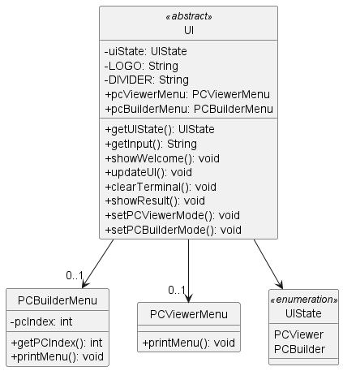
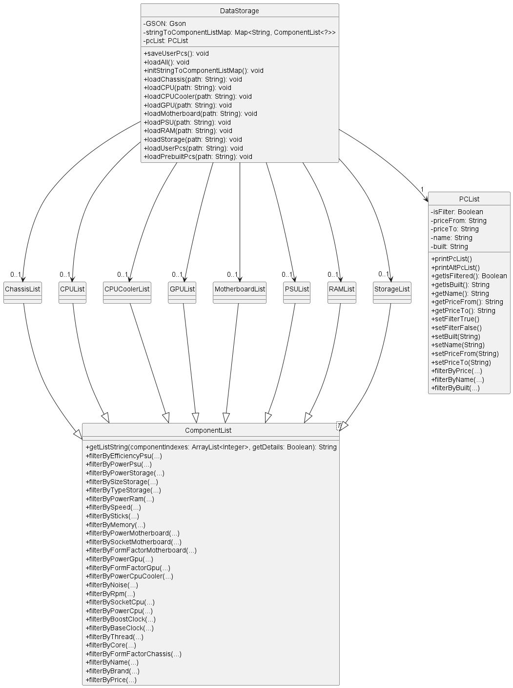
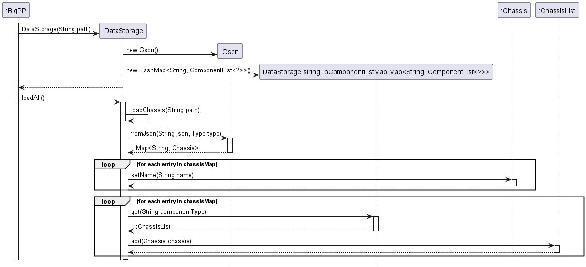
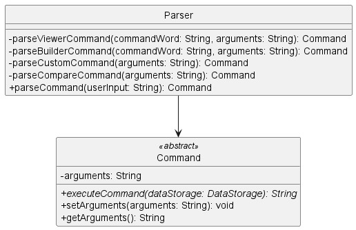
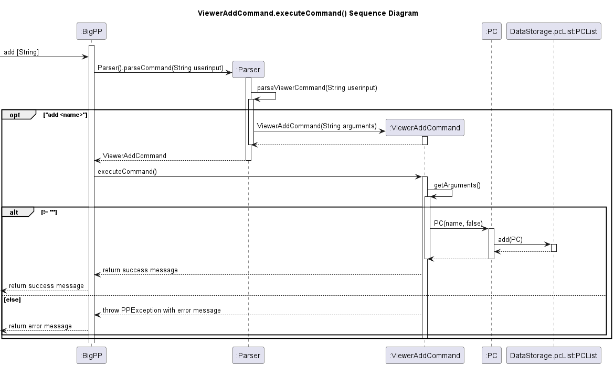
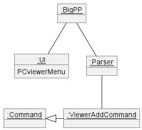

<!-- @@author Magmanat -->
<!-- omit in toc -->
# Developer Guide

<!-- omit in toc -->
## Table of contents

- [Acknowledgements](#acknowledgements)
- [Getting Started](#getting-started)
- [General Overview](#general-overview)
- [Design and implementation](#design-and-implementation)
  - [UI class](#ui-class)
  - [DataStorage class](#datastorage-class)
    - [===== loadChassis() method =====](#-loadchassis-method-)
  - [Parser class](#parser-class)
  - [PC Class Architecture](#pc-class-architecture)
  - [Command class](#command-class)
    - [===== `ViewerAddCommand` method (viewer mode) =====](#-vieweraddcommand-method-viewer-mode-)
    - [===== `BuilderListComponentCommand` (builder mode) =====](#-builderlistcomponentcommand-builder-mode-)
  - [Object Diagram](#object-diagram)
    - [===== Viewer Mode =====](#-viewer-mode-)
    - [===== Builder Mode =====](#-builder-mode-)
- [Appendix: Requirements](#appendix-requirements)
  - [Product scope](#product-scope)
    - [Target user profile](#target-user-profile)
    - [Value proposition](#value-proposition)
  - [User Stories](#user-stories)
  - [Non-Functional Requirements](#non-functional-requirements)
  - [Instructions for manual testing](#instructions-for-manual-testing)

---

## Acknowledgements
These are the external libraries that we have used for developing our application

1. [GSON library](https://sites.google.com/site/gson/gson-user-guide)

___

## Getting Started

Please refer to the [User Guide](https://github.com/AY2223S2-CS2113-T12-2/tp/blob/master/docs/UserGuide.md) for more details on the input/output of the application

---

## General Overview

below is the overall architecture diagram for how BigPP works.

The program will first load the `UserJson` and files in the `Resources` folder to populate its internal memory of `PCLists` and `ComponentLists`. This will be stored in its `DataStorage`. The `User`'s interaction with the `UI` will be `parsed` into a `command` which would update the `DataStorage` and eventually update the `Menu` which is displayed back to the `User`. This would continue until the `User` exits the program, which would result in the data stored in `DataStorage` being saved into the `UserJson`.

---

<!-- @@author typingpanda -->
## Design and implementation

### UI class

Below is the Class diagram for the UI class

The `UI` Class serves as the connection between the user and BigPP. It is responsible for the following key actions

1. **Initialization**: Upon start up of BigPP, the instance of `DataStorage` is parsed into the `updateUI` method of `UI` to give it the ability to access resources for BigPP. `UIState` is set to be `PCViewer`.
2. **Functionality**

- Shows welcome message to the user
- Gets input from the user
- Sets the `UIState` of BigPP depending on user command
- Updates the user interface to show the menu depending on the `UIState`
- Clears the terminal after every user command
- Shows feedback to the user after every user command

3. **Behavior**: The `UI` Class acts as the intermediary between the user and BigPP. `UIState` of `UI` can change between `PCViewer` and `PCBuilder` which would result in different commands available to the user. This makes the possible commands that can be given clear to the user.

In summary, UI gives crucial feedback to the user such as the menu of possible commands based on the current menu and results of a given command.

---

<!-- @@author Magmanat -->

### DataStorage class

Below is the Class diagram for the DataStorage class:

The `DataStorage` class serves as a centralized storage and management system for lists of components and PC builds in the application. It is responsible for the following key actions:

1. **Initialization**: Upon creation, the `DataStorage` class initializes its `stringToComponentListMap` and `pcList` properties, which contain instances of `ComponentList` and `PCList`, respectively. These lists are used to manage components and PC builds within the application.

2. **Functionality**: The `DataStorage` class

   - Loads the entire `user.json` file that is saved in the storage of the user's computer. This json file will contain all of the PC builds that the user has made in his prior usages of BigPP.
   - Loads all of the pre-built PC builds that are in the `Resources` folder that have been pre-set by us for the user to view.
   - Loads all of the data that is in the `Resources` folder which stores pre-loaded data of BigPP which includes all of the component data that is available in our database.
   - Saves all the user data into `user.json` file that is saved in the storage of user's computer when the user inputs the "bye" command.

3. **Behavior**: The `DataStorage` class acts as an intermediary between the application and the stored lists of components and PC builds. It helps to maintain a clean separation of concerns by providing a unified interface for handling data storage and retrieval. This allows the rest of the application to interact with the data easily.

In summary, the `DataStorage` class is responsible for managing lists of components and PC builds, providing methods to load all the data needed, and interact with this loaded data.

---

#### ===== loadChassis() method =====

This Sequential analysis will show how the loadChassis() method works, this will also serve as an example for all the other load methods that the DataStorage class has.

The `loadChassis` method reads chassis information from a JSON file and populates a `ChassisList` with the data.

When the `loadChassis` method is called with a file path as its argument, it first gets a `ClassLoader` instance from the `DataStorage` class and uses it to create an `InputStream` for the specified file. A `BufferedReader` is then created to read the contents of the file.

The JSON file is read and concatenated into a single string using `reduce`. The GSON library is then used to deserialize the JSON string into a `Map<String, Chassis>`, with the key being the name of the chassis and the value being a `Chassis` object.

Next, the method iterates over the `chassisMap` and sets the name attribute of each `Chassis` object to its corresponding key in the map.

Finally, the method iterates over the `chassisMap` again, adding each `Chassis` object to the `ChassisList` stored in the `stringToComponentListMap` HashMap.

A UML sequence diagram showing the interactions between the different objects involved in handling this method can be
found below:

---

<!-- @@author Reynold-SL -->

### Parser class

The UML class diagram shows the features of the Parser class:

The purpose of the Parser class is to parse the user input into commands for execution. With reference to the diagram,
the Parser class does not have any attributes and only contains public methods for parsing of the user input.
The methods in the Parser class creates a subclass which inherits from the abstract superclass Command class.
From the diagram, Command class has a private attribute named arguments which stores the user inputs as a String. The Command class
contains methods that help to set and retrieve the private attribute in the class.
Overall, this class diagram provides an overview of the purpose of the Parser class.

---

<!-- @@author Ryujikjs -->

### PC Class Architecture

(Note: all private properties have getters and setters but have been omitted to make diagram more readable)

This UML class diagram shows the classes and their relationships in a computer system, which is represented by the `PC` class. The PC class has several attributes, including name, isPrebuilt, cpu, cpuCooler, gpu, motherboard, ram, storage, psu, chassis, and budget.

The `CPU`, `CPUCooler`, `GPU`, `Motherboard`, `RAM`, `Chassis`, `PSU` and `Storage` classes are components that can be used to build a `PC` object. Each component class has its own attributes and methods specific to that component.

The `Component` class is an abstract class that represents a generic computer component. It has attributes such as name, brand, and price, as well as methods to get and set those attributes.

The `PC` class has methods to set and get the components of a `PC` object, as well as methods to set and get the name, isPrebuilt, and budget attributes.

Overall, this class diagram provides a high-level overview of the components that make up a computer system and their relationships to each other.

---

<!-- @@author Reynold-SR -->

### Command class

#### ===== `ViewerAddCommand` method (viewer mode) =====

This Sequential analysis will show how the `ViewerAddCommand` method works, this will also serve as an example for the `ViewerDeleteCommand` and `ViewerViewCommand`.
During the ParseCommand, when a add command is detected in the user input, it will call the `ViewerAddCommand` method with
a name as its argument. The `ViewerAddCommand` then calls a method to retrieve the argument.The `ViewerAddCommand`
checks if the argument is empty and throws an `PPException` if it is empty. A `PC` object is created with the argument as
an input. The `add` method is called by accessing the `dataStorage` and `pcList` classes to add the `PC` object to the list.
Finally, a message is returned to inform the user that the `ViewerAddCommand` method has been executed successfully.

A UML sequence diagram showing the interactions between the different objects involved in handling this method can be
found below:

---

<!-- @@author superkaiba -->

#### ===== `BuilderListComponentCommand` (builder mode) =====

The `BuilderListComponentCommand` command prints out a formatted list of all available components of type `COMPONENT`.

When the user inputs a command of the form `list [COMPONENT]` in builder mode,
it is parsed by the `Parser.parseBuilderCommand` method which recognizes the first word as
`list` and creates a new `BuilderListComponentCommand` object while passing as argument the component
which was part of the command.

The `BuilderListComponentCommand.executeCommand()` method is then executed as part of the loop
inside `BigPP.runLoopUntilExit()`.

It first verifies:

- That the component argument is not empty. If it is then it throws a `BuilderMissingComponentException()`
- That the component given by the user exists in the database. If it doesn't then it throws a
  `BuilderMissingComponentException()`

It then uses the `stringToComponentListMap` HashMap from data storage to get the ComponentList associated
with the component string input by the user (e.g. `cpu`). The `stringToComponentListMap` HashMap is initialized and
filled when the program is first run using `DataStorage.initStringToComponentListMap()` and maps component names
(e.g. `cpu`) to their corresponding `ComponentList` object (e.g. an object of type `CPUList`).

The `ComponentList` class inherits from `ArrayList` but additionally implements the `getListString()` method which
returns a formatted list of all the components in the `ComponentList` object.

The `ComponentList` objects for each component are instantiated and populated in the `DataStorage.loadAll` method
by loading the data in `resources/COMPONENT_NAME.json` using the `GSON` library.

The program then checks if the user provided any flags to filter the output of the component command (e.g. by name,
brand, price, etc.). If they did, then the program filters out the components not meeting the provided flags and
creates a `ComponentList` containing all the components which do meet the provided flags.

The program then uses the `ComponentList.getListString()` method to get a formatted list of the components
of the desired type, which it then outputs to the user.

A UML sequence diagram showing the interactions between the different objects involved in handling this command can be
found below:

---

<!-- @@author typingpanda -->

### Object Diagram

In these object diagrams, a typical flow of the program is shown. The first diagram shows the flow of the program when the user is in the viewer mode and adds a PC. Then, the second diagram shows the flow of the program when the user is in the builder mode and edits the name of the PC added.
#### ===== Viewer Mode =====

When the program first starts, the `BigPP` class is instantiated and the `run()` method is called. The `run()` method calls the `runLoopUntilExit()` method which is a loop that runs until the user exits. The `UI` calls the `getInput()` method to get the user input. The `Parser` class then parses the user input ("add MyPC"). The `parseCommand` method calls the `ViewerAddCommand` method with the name of the PC as the argument. The `ViewerAddCommand` calls its executeCommand method. This adds a PC named "MyPC".

#### ===== Builder Mode =====

The user can enter the `edit PC_INDEX` command to edit a PC and enter Builder Mode. Now in builder mode, the user can enter the `name NAME` command to edit the name of the PC. The `Parser` class then parses the user input ("name MyEditedPC"). The `parseBuilderCommand` method calls the `BuilderNameComponentCommand` method with the name of the PC as the argument. The `BuilderNameComponentCommand` calls its executeCommand method. This edits the name of the PC to "MyEditedPC".

---

<!-- Ryujikjs -->

## Appendix: Requirements

### Product scope

#### Target user profile

People who want to build PC's and keep track of their builds.

#### Value proposition

- Saves time and effort in selecting PC components
- Helps users avoid compatibility issues or mistakes
- Enables users to build cost-effective systems.
- Prebuilt PCs

### User Stories

|Version| As a ... | I want to ... | So that I can ...|
|--------|----------|---------------|------------------|
|v1.0|new user|See usage instructions|Refer to them when I forget how to use the application|
|v1.0|user|Create a new custom PC|Start a fresh PC build|
|v1.0|user|Add and delete computer components|Build my computer and remove unwanted builds|
|v1.0|user|View the components of my PC build|See the entire PC build and which components have been chosen|
|v1.0|user|Edit a PC build|Customize the components of a PC build to my liking|
|v1.0|user|Select and unselect componetns from the PC|Choose and change the components as i wish|
|v1.0|user|Change the name of my PC build|Identify my different PC build by their custom name|
|v1.0|frugal user|Add a budget to my build|Ensure that my PC build does not exceed what i am willing to spend|
|v1.0|user|List all the selectable components of a certain type|View the available options for a certain component|
|v2.0|comparitive user|Compare the specifications bettween two components|Have a side by side comparison and choose the better component|
|v2.0|user|Filter the PC builds by ther name/budget/completion|View all PC build that satisfy my requirements|
|v2.0|Experienced user|Add custom components|Add components to my build that are not availabe in the component list|
|v2.0|new builder|Be able to see if components are not compatible|Avoid building PC with incompatible parts|
|v2.0|Experienced user|Filter the component list by specifications|Find specific components that meet my criteria|

### Non-Functional Requirements

1. Java 11 or above installed
2. Program built to support only single user
3. Size of terminal

### Instructions for manual testing

1. Download the latest `.jar`  file from this [link](https://github.com/AY2223S2-CS2113-T12-2/tp/releases).
2. Open the folder that the `.jar` file is in and run the program in your terminal using `java -jar bigpp.jar`.
3. Read through user guide to get detailed documentation on functionality and commands of application.
4. See all available commands by using `help`.
5. View Prebuilt PC specifications using `view 1`
6. Create a new PC using `add newPC`.
7. Edit the newly created PC by using `edit 4`.
8. Set a Budget for the build by using `budget 1000`.
9. List all cpu components available by using `list cpu`.
10. List cpu compoennts that are filterd by price by using `list cpu -price /from 0 /to 200`.
11. Select cpu by using `select cpu 1`.
12. Select compatible motherboard by using `select motherboard 1`.
13. Unselect cpu by using `unselect cpu`.
14. Compare two motherboard components by using `compare motherboard 2 & 7`.
15. Change the Name of the build by using `name notNewPC`.
16. Add custom cpu to the build by using `custom cpu Intel-new-cpu|Intel|99.5|4|8|3.5|4.6|122|LGA1200`.
17. Go back to the viewer menu by using `back`.
18. Filter the avilable PC builds to see only incomplete builds by using `filter -built incomplete`.
19. Use `bye` to exit program.
